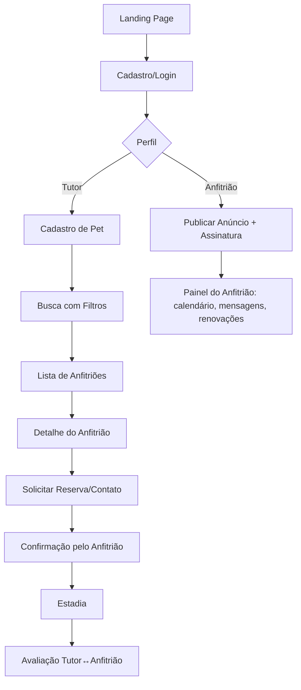
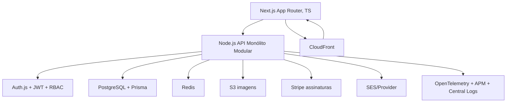

# PRD

Ótima pergunta! Para este momento, eu recomendo um **monólito bem estruturado (estilo “modular monolith”)**:

- **Por quê agora?** Acelera o **time-to-market do MVP**, reduz custo operacional/devops e evita complexidade prematura de observabilidade, coordenação e orquestração entre serviços.
- **Sem “dívida futura”?** Ao adotar **fronteiras de domínio claras (Hexagonal/DDD)**, **módulos internos** (ex.: `auth`, `listings`, `search`, `booking`, `billing`, `reviews`) e **contratos explícitos** entre módulos, você mantém a opção de **extrair microserviços** no futuro sem reescrever o core.

A seguir, já entrego o **PDR completo** com essa decisão refletida em todas as seções.

---

# PDR – Micro SaaS “PetStay” (MVP com Monólito Modular)

## 1) Visão Geral do Produto

**Contexto:** O PetStay é uma plataforma de marketplace que conecta **tutores** de cães e gatos a **anfitriões** que oferecem hospedagem domiciliar durante viagens.

**Proposta de valor:**

- Para **tutores**: busca rápida por anfitriões confiáveis, com filtros (localização, preço, disponibilidade, avaliações, políticas para pets).
- Para **anfitriões**: vitrine profissional com plano de **assinatura mensal** para manter o anúncio ativo e ganhar visibilidade.
    
    **Diferenciais:** foco exclusivo em **pets** (cães e gatos), **curadoria**, **reviews verificadas**, e base preparada para **IA** (recomendações personalizadas, ranking de qualidade, detecção de fraudes/abuso).
    
    **Objetivos (12 meses):**
    
- Lançar **MVP** com busca, cadastro, assinaturas e avaliações.
- Alcançar **1.000 anfitriões assinantes** e **10.000 tutores** cadastrados.
- Taxa de conversão tutor→contato ≥ **8%** e NPS ≥ **60**.

---

## 2) Personas e Casos de Uso Principais

**Tutor (Maria, 34)**

- Precisa encontrar hospedagem segura para seu gato por 5 dias no próximo feriado.
- Casos de uso: criar conta, cadastrar pet, buscar por bairro/datas/preço, favoritar, entrar em contato/reservar, avaliar pós-estadia.

**Anfitrião (João, 41)**

- Hospeda 2 cães simultaneamente, tem quintal e envia fotos diárias.
- Casos de uso: criar conta, publicar anúncio (fotos, políticas, preço/dia), configurar calendário, contratar/renovar **assinatura**, responder solicitações, administrar avaliações.

**Admin (operação PetStay)**

- Casos de uso: moderação de anúncios/avaliações, suporte, gestão de planos e billing, relatórios, cupons.

---

## 3) Fluxo de Usuário (User Flow)

---

## 4) Arquitetura Técnica

### 4.1 Diagrama Conceitual

### 4.2 Escolhas Tecnológicas e Integração

- **Frontend:** **Next.js + TypeScript** (SSR/SSG híbrido, SEO, roteamento avançado, formulários com React Hook Form + ZodResolver, upload de imagens para S3 via URLs assinadas).
- **Backend (monólito modular):** **Node.js (TS)** com arquitetura **Hexagonal**, módulos internos (`auth`, `users`, `pets`, `listings`, `search`, `booking`, `billing`, `reviews`, `admin`). **Zod** para validação/DTOs; **Prisma** para ORM e migrações.
- **Banco:** **PostgreSQL** para consistência transacional (reservas, assinaturas). Índices GIN + trigram para busca textual/por proximidade; extensões `pg_trgm`, `cube`/`earthdistance` (ou cálculo Haversine).
- **Cache:** **Redis** para sessões server-side, rate limiting, cache de listagens populares e resultados de busca.
- **Pagamentos:** **Stripe** com **Billing** (products, prices, subscriptions, webhooks) para **assinaturas de anfitriões**; status de anúncio vinculado ao `subscription_status`.
- **Infra/Deploy:** **Docker + Docker Compose** local; em produção **AWS** (App Runner ou ECS Fargate), **RDS Postgres**, **ElastiCache Redis**, **S3** imagens, **CloudFront** CDN, **Route 53** DNS, **SES** e-mail.
- **Auth & Segurança:** **Auth.js** (e.g. credenciais + OAuth opcional), **JWT** com expiração curta, **Refresh Tokens** armazenados com **rotacionamento**, **CSRF** nas rotas sensíveis, **Helmet**, **rate limiting via Redis**, **CORS** restrito.
- **Observabilidade:** OpenTelemetry (traces/metrics), logs estruturados (pino/winston), dashboards (CloudWatch/Grafana).
- **CI/CD:** GitHub Actions (lint, typecheck, tests, prisma migrate, build, scan), deploy automatizado por branch/tag.

---

## 5) Requisitos Funcionais

1. **Autenticação & Perfis**
    - Cadastro/login (tutor/anfitrião), recuperação de senha, 2FA opcional.
    - Perfil Tutor: dados pessoais + pets (espécie, porte, temperamento, necessidades).
    - Perfil Anfitrião: endereço (geocodificado), fotos, políticas (ex.: aceita filhotes? porte?), preço/dia, número de vagas, regras da casa, verificação básica (documento/selfie KYC fase V1).
2. **Listagens (Anfitriões)**
    - CRUD de anúncios; upload de imagens (S3 com validação de tamanho e extensão).
    - Calendário de disponibilidade; bloqueio por datas.
    - Status condicionado à **assinatura ativa**.
3. **Busca & Filtros**
    - Por **localização** (raio), datas, preço, porte, serviços (passeio/banho/medicação), avaliação mínima.
    - Ordenação por relevância, preço, distância, rating.
4. **Reservas/Contato**
    - MVP: **intenção de reserva** → mensagem ao anfitrião + bloqueio suave de data (opcional).
    - V1: confirmação do anfitrião e pré-reserva com política de cancelamento; capturas não necessárias (somente assinatura do anfitrião paga a plataforma).
5. **Assinaturas (Billing)**
    - Planos: **Basic** (features base) e **Pro** (maior destaque, posicionamento na busca, badge).
    - Ciclo mensal via **Stripe Billing**, nota de renovação, retry dunning, webhook para atualizar `subscription_status`.
6. **Avaliações & Reputação**
    - Avaliação bilateral com nota + comentário, **apenas após estadia** (ou após troca de 5+ mensagens confirmadas no MVP).
    - Moderação (admin) com flags e remoção.
7. **Painéis**
    - Tutor: pets, mensagens, reservas/contatos, avaliações feitas/recebidas.
    - Anfitrião: performance do anúncio, calendário, mensagens, status da assinatura, renovação/upgrade.
    - Admin: moderação, relatórios, cupons, métricas de crescimento.
8. **Internacionalização & Acessibilidade**
    - i18n básico (pt-BR inicialmente), padrões de **A11y** (WCAG AA).

---

## 6) Requisitos Não Funcionais

- **Segurança:** OWASP ASVS, senhas com argon2/bcrypt, secrets em **AWS Secrets Manager**, **LGPD** (propósito, consentimento, deleção), criptografia **em trânsito (TLS)** e **em repouso** (RDS/S3).
- **Escalabilidade:** monólito **stateless** atrás de **Auto Scaling**; **cache Redis** para hot paths; filas SQS para tarefas assíncronas (thumbs de imagens, e-mails).
- **Performance:** p95 < 300 ms em endpoints críticos de busca; imagens servidas via CDN; N+1 queries evitadas com Prisma `include`/`select` e índices adequados.
- **Observabilidade:** tracing distribuído, logs JSON, **correlação** de requisições, alarmes de erro/latência.
- **Backups/DR:** snapshots diários do RDS, versionamento S3, **RPO 24h / RTO 4h** no MVP.
- **Disponibilidade alvo:** 99,5% MVP; 99,9% V1.

---

## 7) Plano de Monetização e Custos Operacionais (estimativa inicial)

- **Monetização:** assinatura mensal dos **anfitriões** (R$ 39 Basic / R$ 79 Pro — valores de referência; validar com pesquisa).
- **Upsell Pro:** destaque na busca, badge de qualidade, insights de performance, fotos extras, prioridade nas recomendações.
- **Custos (AWS, por mês – ordem de grandeza):**
    - App Runner/ECS (1–2 instâncias conservadoras): R$ 120–400
    - RDS Postgres t4g.micro: R$ 120–250
    - ElastiCache Redis small: R$ 100–220
    - S3 + CloudFront (tráfego baixo): R$ 30–120
    - SES: baixo (centavos por e-mail)
    - Stripe: sem mensalidade; taxa por transação em cartão (aplica nas assinaturas).

> Observação: otimizar custos iniciando pequeno (1 zona, instâncias menores) e ampliando conforme tração.
> 

---

## 8) Roadmap (MVP → V1 → V2)

**MVP (0–8 semanas)**

- Autenticação, perfis, CRUD de anúncios, upload de imagens, busca com filtros essenciais, mensagens/contato, **Stripe Billing** (ativação/desativação de anúncio), avaliações simples, painéis básicos, observabilidade mínima, deploy CI/CD.

**V1 (2–4 meses)**

- Disponibilidade por calendário, reservas confirmáveis, políticas de cancelamento, **ranking** (qualidade/engajamento), verificação básica (documento/selfie), relatórios para anfitriões, cupons de assinatura, refinamento de LGPD.

**V2 (4–8 meses)**

- **IA & Personalização** (recomendações), detecção de fraudes/abusos, busca semântica (embeddings), lead scoring, app mobile (React Native/Expo), programa de confiança verificada, multi-moeda/multi-idioma, integrações de marketing (utm, pixel).

---

## 9) Stack Completa e DevOps

- **Frontend:** Next.js (App Router), TS, React Hook Form, Zod, TanStack Query, Tailwind (ou CSS Modules), Upload direto para S3 via URL assinada.
- **Backend:** Node.js TS, Express/Fastify, Zod (input/output), Prisma (migrações), Auth.js, JWT/Refresh, RBAC simples (roles: `tutor`, `host`, `admin`).
- **Infra:** Docker, AWS App Runner/ECS Fargate, RDS, ElastiCache, S3, CloudFront, SES, Route 53, Secrets Manager.
- **CI/CD:** GitHub Actions (jobs: lint, test, typecheck, prisma generate/migrate, build, docker push, deploy).
- **Qualidade:** ESLint, Prettier, Husky + lint-staged, Jest/Vitest + Testing Library, e2e (Playwright) nas rotas críticas.
- **Dados & Busca:** Postgres com índices geográficos e textuais; **opcional**: promover para **OpenSearch** na V1 se a busca avançada ficar pesada.
- **Rate Limiting:** Redis (token bucket) por IP/rota.
- **Feature Flags:** simples via tabela `feature_flags` (ou LaunchDarkly se necessário).

---

## 10) Riscos e Mitigações Técnicas

- **Marketplace “ovo–galinha” (poucos anfitriões → pouca demanda):** incentivos iniciais (cupom 3 meses), curadoria ativa, SEO local.
- **Fraudes/abuso:** KYC básico V1, verificação de telefone/e-mail, moderação de conteúdo, detecção anômala (V2).
- **Custos de mídia (fotos):** compressão/resize assíncrono, limites por plano, CDN.
- **Escalabilidade de busca por raio:** índices e pré-cálculo; fallback para OpenSearch quando picos.
- **LGPD/privacidade:** minimização de dados, retenção limitada, DSR (data subject requests) no painel.
- **Vendor lock-in:** camadas de infraestrutura abstraídas (ports/adapters), repositórios com Prisma, S3 API compatível (MinIO em dev).
- **Disponibilidade:** health checks, auto scaling, circuit breakers, retries exponenciais.

---

## 11) KPIs e Métricas de Sucesso

- **Aquisição:** novos anfitriões/mês, CAC de anfitriões, % ativação (perfil completo + assinatura).
- **Engajamento:** buscas/tutor ativo, CTR em cards, mensagens iniciadas, taxa tutor→contato.
- **Retenção/Receita:** churn de assinaturas, MRR/ARR, LTV por anfitrião, ARPU.
- **Qualidade:** taxa de resposta do anfitrião, SLA de resposta (p95), rating médio, incidência de disputas.
- **Confiabilidade:** uptime, p95 de latência de busca, erro por mil requisições.

---

## 12) Sugestões Futuras de IA e Personalização

- **Recomendações** (V2): híbrido **conteúdo + colaborativo**; features (porte aceito, políticas, distância, preço, taxa de resposta).
- **Busca Semântica:** embeddings (OpenAI/Azure/Vertex) para descrição dos anúncios → **reranking** sobre resultado filtrado por raio/preço.
- **Detecção de Spam/Abuso:** classificação de mensagens e avaliações.
- **Qualidade do Anúncio:** score automático (completude, fotos, engajamento) para ranqueamento.
- **Assistente de Onboarding do Anfitrião:** agente que sugere preço, políticas e fotos que aumentam conversão.

---

## Esquema de Domínios (alto nível)

- **Auth/Users:** `users(id, role, email, hashed_password, created_at)`, `sessions`, `refresh_tokens`.
- **Hosts/Listings:** `hosts(id, user_id, kyc_level)`, `listings(id, host_id, title, desc, price_per_day, lat, lng, policies, photos[], status)`, `availability(listing_id, date, is_blocked)`.
- **Pets/Tutors:** `tutors(id, user_id)`, `pets(id, tutor_id, species, size, temperament, notes)`.
- **Interactions:** `messages(id, listing_id, from_user, to_user, body, created_at)`, `favorites`.
- **Reviews:** `reviews(id, reviewer_id, reviewee_id, booking_id?, rating, comment)`.
- **Billing:** `plans(id, name, features, price)`, `subscriptions(id, host_id, plan_id, stripe_sub_id, status, current_period_end)`.

---

## Decisão Arquitetural – Monólito Modular

- **Motivação:** simplicidade operacional, rapidez no MVP, custo baixo, menor carga cognitiva do time.
- **Como evitar “Big Ball of Mud”:**
    - **Camadas**: `domain` (regras), `application` (casos de uso), `infrastructure` (adapters), `interfaces` (HTTP).
    - **Bounded Contexts** internos: `auth`, `listings`, `search`, `billing`, `reviews`.
    - **Contratos** entre módulos via **TypeScript types** + **Zod**; **eventos internos** (in-process) para acoplamento fraco (ex.: “subscription_activated” → `listings` reativa anúncio).
    - **Pontos de Extração** claros para microserviços no futuro (ex.: `billing` e `search`).

---

## Checklists de Entrega (MVP)

- [ ]  Infra IaC mínima (Terraform ou CD as code do provedor) para RDS, S3, Redis (ou instância gerenciada).
- [ ]  GitHub Actions com gates (tests, typecheck, quality).
- [ ]  Auth.js + JWT/Refresh + RBAC.
- [ ]  CRUD de anúncios (fotos S3), busca por raio/preço, mensagens, avaliações simples.
- [ ]  Stripe Billing com webhooks (ativar/desativar anúncio).
- [ ]  Observabilidade (logs/traces/alarms).
- [ ]  Política LGPD (consentimento, deleção, export).
- [ ]  Documentação de API (OpenAPI) e contratos de módulos (Zod schemas).

---

### Conclusão

Começar com **monólito modular** é a forma mais **rápida, barata e segura** de validar o PetStay. A arquitetura proposta já **antecipa a evolução** para componentes independentes quando a tração exigir (ex.: **`billing`** e **`search`** como primeiros candidatos). O plano acima entrega um **MVP sólido**, com **fundação de segurança e observabilidade**, e um **caminho claro** para V1/V2 com **IA** e diferenciais competitivos.

Se quiser, já preparo:

1. o **esqueleto do repo** (pastas, scripts, exemplos de módulos),
2. o **diagrama Mermaid detalhado de classes/entidades**, e
3. um **checklist de sprints (4 x 2 semanas)** com histórias e critérios de aceite.